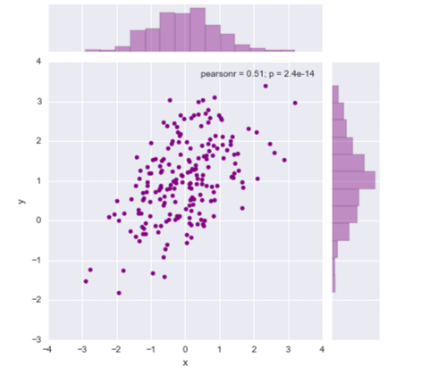

## Matplotlib


#### Simple plot

```python

import matplotlib.pyplot as plt
import numpy as np

t = np.arange(0.0, 2.0, 0.01)
s = np.sin(2*np.pi*t)
plt.plot(t, s)

plt.xlabel('time (s)')
plt.ylabel('voltage (mV)')
plt.title('Title')
plt.grid(True)
# plt.savefig("test.png")
plt.show()
```


#### Pair plot

```python
import matplotlib as plt
import seaborn an sns

g = sns.PairGrid(iris, hue="species") # iris: 2D, hue is species
g.map_diag(plt.hist)
g.map_offdiag(plt.scatter)
```


#### Joinplot

```python
mean, cov = [0, 1], [(1, .5), (.5, 1)]
data = np.random.multivariate_normal(mean, cov, 200)
df = pd.DataFrame(data, columns=["x", "y"])

sns.jointplot(x="x", y="y", data=df,color="purple");

print df.head()
```

```
          x         y
0 -0.208910  1.024767
1 -1.575370 -1.101655
2 -0.694578  0.172188
3 -1.555686 -0.480768
4  0.128076  0.444223
```




